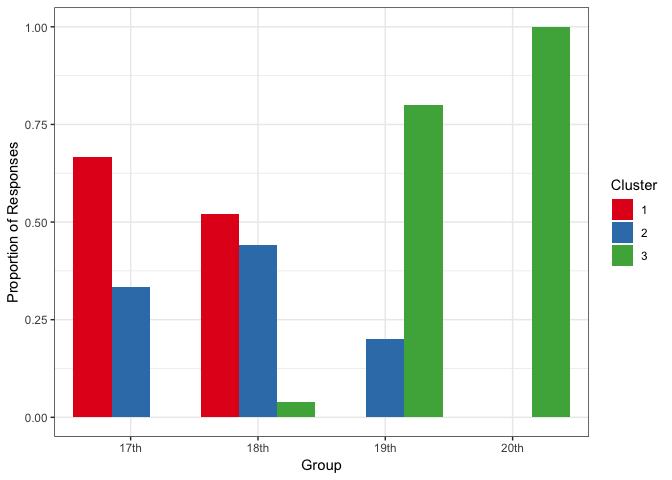

<!-- README.md is generated from README.Rmd. Please edit that file -->
clustRcompaR
============

The goal of clustRcompaR is to make it easy to cluster (or group) a series of documents (texts of any length), and to interpret these groups and to describe their frequency across factors, such as between different groups or over time.

Installation
------------

You can install the development version of clustRcompaR from GitHub with:

``` r
# install.packages("devtools")
devtools::install_github("alishinski/clustRcompaR")
```

You can install the stable release on CRAN with:

``` r
install.packages("clustRcompaR")
```

Example
-------

This is a basic example using the built-in inaugural addressess dataset.

First, we use `cluster()` to cluster the documents into three clusters. We include a new variable, `year_before_1900`, which we will later use to compare frequencies across clusters. Then we use `extract_terms()` to view the terms and term frequencies in the two clusters.

First, let's process the texts.

``` r
library(clustRcompaR)
library(dplyr)
#> 
#> Attaching package: 'dplyr'
#> The following objects are masked from 'package:stats':
#> 
#>     filter, lag
#> The following objects are masked from 'package:base':
#> 
#>     intersect, setdiff, setequal, union

d <- inaugural_addresses
d <- mutate(d, century = ifelse(Year < 1800, "17th",
                                ifelse(Year >= 1800 & Year < 1900, "18th",
                                       ifelse(Year >= 1900 & Year < 2000, "19th", "20th"))))
```

Next, we **cluster** the texts.

``` r
three_clusters <- cluster(d, century, n_clusters = 3)
#> Document-feature matrix of: 58 documents, 2,820 features (79.6% sparse).
extract_terms(three_clusters)
#>    Cluster.1.Terms Cluster.1.Term.Frequencies Cluster.2.Terms
#> 1               in                  34.200000              in
#> 2               my                  13.866667           their
#> 3            their                  12.333333          govern
#> 4             will                  11.200000            will
#> 5           govern                   9.533333             has
#> 6            peopl                   7.200000              it
#> 7               it                   7.133333           state
#> 8           nation                   7.000000            been
#> 9              has                   6.733333           peopl
#> 10         countri                   6.533333          nation
#>    Cluster.2.Term.Frequencies Cluster.3.Terms Cluster.3.Term.Frequencies
#> 1                    77.52941              in                  36.692308
#> 2                    22.88235            will                  16.076923
#> 3                    21.41176          nation                  12.500000
#> 4                    20.29412              us                  12.038462
#> 5                    20.00000           world                   9.807692
#> 6                    19.41176           peopl                   9.307692
#> 7                    18.23529             can                   7.769231
#> 8                    17.82353            must                   7.730769
#> 9                    16.05882         america                   7.423077
#> 10                   14.41176              no                   7.192308
```

Then, we use the `compare()` function to compare the frequency of clusters across a factor, in this case, the century. We can then use the `compare_plot()` or `compare_test()` (which uses a Chi-Square test) function.

Here, we can **compare** the texts.

``` r
three_clusters_comparison <- compare(three_clusters, "century")
compare_plot(three_clusters_comparison)
```


